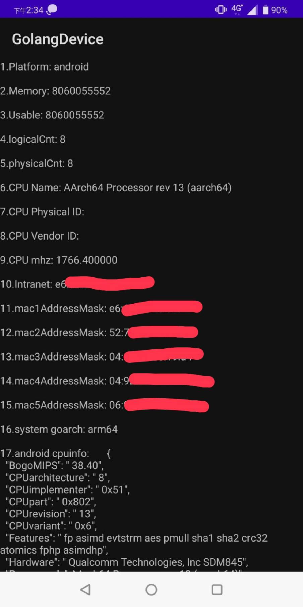

## Introduction
This is a way to grab the underlying device information through Golang, and call aar through java to run the application.This project is to use aar to let java use, the next project will introduce cgo to so, let java call it.

## Step1
Please confirm whether it can be executed
``` 
go run *.go
```

## Step2
Please install gomobile
https://github.com/golang/go/wiki/Mobile

## Step3
Please enter Gomobile command to generate AAR file
```
cd mobile
gomobile bind -o app/model.aar C:\Users\bruce\Desktop\gitlab\gomobile\golang\model
```
## Step4
Enter the mobile/app/AAR file of this path into android studio

## DEMO Screen
